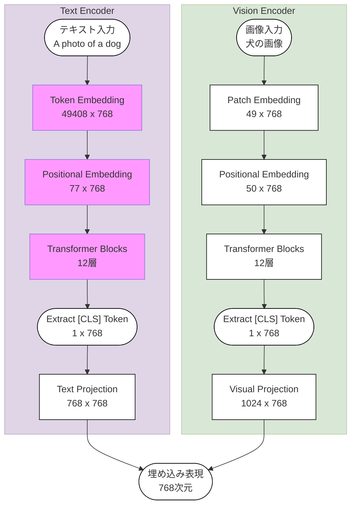

## 

## 動機

Stable Diffusionモデルの特性を調べるうえで、CLIPScoreという指標があることを知りました。

特に継続学習したモデルを調べようと思ったのですが、訓練に使用された・埋め込まれているCLIPモデルを特定する必要があると思いました。また、LoRAなどの学習ではText Encoderも学習させることができます。

そこで、Stable DiffusionモデルからCLIPを取り出して使うことができるのかを検証しました。

## モデルの構造

CLIPは、画像のキャプションのペアを用いて、TextのEncoderと画像のEncoderが近い埋め込みを返すように訓練したモデルです。

CLIPのうち、Stable Diffusionに埋め込まれているのはフローチャート中にピンクで示した部分です。勉強中なので、作図は誤っている可能性があります。

図の通り、Stable DiffusionはCLIPのText Encoderをすべて使っているわけではありません。CLIPはテキストの情報を分類のための[CLS]トークンに集約させて使っています。一方で、Stable Diffusionでは精度の高い推論のためにすべてのトークンに対する埋め込み表現を用いています。
<!-- https://huggingface.co/blog/stable_diffusion -->

したがって、実はStable Diffusionから純粋なCLIPのText Encoderを取り出して使うことができませんでした。

## 実装方針

はじめにCLIPの実装ですが、OpenAI CLIPを用いました。今から考えると、Huggingface TransformersのCLIPのCLIPTextModelなどを使ったほうが楽だったかもしれませんが...

リサーチ

OpenAI CLIPを使った方法はあった。しかしライブラリのコードをいじる。これは再現性が低くなる。
別の方法を検討したい（でもよく考えたらコードをフォークしたらそれで済んだのでは）
https://github.com/openai/CLIP/issues/113

CLIPTextModel使ったほうが絶対楽だったぞ...
https://huggingface.co/docs/transformers/en/model_doc/clip#transformers.CLIPTextModel

実装の大まかな方針

無いレイヤーはCLIPから取ってくる
CLIPのstate_dictからのロード機能を使う

TODO

- [ ] state_dictとは？（なんか共通規格っぽいけど誰が定義したの？Torch？）
- [ ] 実際のレイヤーは階層構造になっているけど、state_dictでは開いている

ソース

https://github.com/xhiroga/til/tree/main/software-engineering/openai/clip/_src/text-encoder-only

評価

ViT/L-14と、同じテキストを埋め込みにしてコサイン類似度を測る

結果

<!-- https://claude.ai/chat/19b185aa-b5be-49f1-a73b-9a88a38fab48, https://claude.ai/chat/8134061b-e048-424f-96f1-a224ce43e764 -->
