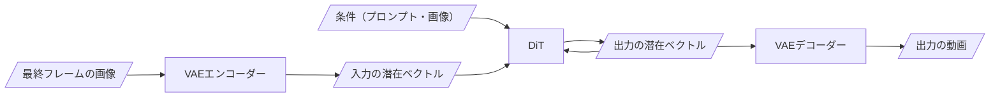

```mermaid
block-beta
    columns 72
    1Section:36 2Section:36
    1LF:4 2LF:4 3LF:4 4LF:4 5LF:4 6LF:4 7LF:4 8LF:4 9LF:4 10LF:4 11LF:4 12LF:4 13LF:4 14LF:4 15LF:4 16LF:4 17LF:4 18LF:4
    1F 2F 3F 4F 5F 6F 7F 8F 9F 10F 11F 12F 13F 14F 15F 16F 17F 18F 19F 20F 21F 22F 23F 24F 25F 26F 27F 28F 29F 30F 31F 32F 33F 34F 35F 36F 37F 38F 39F 40F 41F 42F 43F 44F 45F 46F 47F 48F 49F 50F 51F 52F 53F 54F 55F 56F 57F 58F 59F 60F 61f 62f 63f 64f 65f 66f 67f 68f 69f 70f 71f 72f
```

TODO: ここにkisekaeなどのサンプルを入れる

## FramePackとは？

Hunyuan Videoの動画生成モデルを用いた動画・画像生成フレームワークです。ざっくり言えば次のとおり動画・画像を生成しています。



フローチャートでご覧の通り、FramePackは動画全体をまとめて生成せずに、動画を圧縮した潜在ベクトルをいくつかのセクションに分けて生成します。

例えば30fpsで1.2秒(72f)の動画を生成する場合、かつ1セクションあたり9潜在フレームを含む場合、だいたい次のようになります。

TODO: あまりにも小さすぎるので差し替える...



<!-- ComfyUIでFramePackを使って動画生成をされた方は、出力される動画のフレーム数として指定できる値が特徴的であることに気付いたと思いますが、それはこれが関係しています。 -->

TODO: ここに関連ツールのごく簡単な年表を入れる

## LoRA学習

### 本当にLoRA学習の必要があるか？

TODO: 初めはプロンプトを探求した方が良い的なこと

### クオリティ・費用・期間

純粋な学習だけ見れば、シンプルなプロンプトのみで指定できる動き・変化については、$25・1日以内で学習ができます。

TODO: 人件費や試行錯誤について

### データセット

目的によってデータセットのサイズが異なります。例えば、カメラをズームしたり、パンするような挙動では、おそらく20セット程度あれば学習できます。

目安としては、1種類のプロンプトで指示できる範囲の動きや変化なら、少量のデータでも学習できる気がします。

（個人的には、LoRA = モデルの追加学習ではなく、Soft Promptなどのプロンプトのチューニングでも達成できる気がします）

一方で、入力した動画・画像に応じて多様な動きをさせる場合、もうちょっとデータセットが必要かもしれません。

（この画像は記事用に新規に書き下ろしており、実際に学習に使っているものとは異なります）

この辺りは探っているところです。

### GPUクラウド

筆者はRunPodを利用しています。Vast.ai や Lambda Cloudも学習に使ったことがありますが、次の点でRunPodを採用しています。

- ストレージのアタッチ
- Serverlessも使える（？）

マシンにはまずRTX6000Adaなどで環境を作りきって2~3steps回し、次にh100などに切り替えて（適宜バッチサイズと学習率も切り替える）

## 設定

私([@xhiorga](https://x.com/xhiroga))は、FramePackのLoRA学習では [musubi-tuner](https://github.com/kohya-ss/musubi-tuner) を使っています。

2025-07時点では、次のような設定を使っています。1フレーム学習の設定です。

```config.toml
# 参考
# https://github.com/kohya-ss/musubi-tuner/blob/main/docs/framepack_1f.md

dit = "/workspace/models/diffusion_models/FramePackI2V_HY/diffusion_pytorch_model-00001-of-00003.safetensors"
vae = "/workspace/models/vae/diffusion_pytorch_model.safetensors"
text_encoder1 = "/workspace/models/text_encoder/model-00001-of-00004.safetensors"
text_encoder2 = "/workspace/models/text_encoder_2/model.safetensors"
image_encoder = "/workspace/models/image_encoder/model.safetensors"
dataset_config = "/workspace/my-framepack-project/configs/v8/dataset.toml"

blocks_to_swap = 20
split_attn = true
img_in_txt_in_offloading = true

seed = 42
mixed_precision = "bf16"

# Turntableではflash_attnを有効化していたが、One Frame学習での効果が分からないので一旦sdpaで。
sdpa = true
network_module = "networks.lora_framepack"

# キャラクターを回転させるなど、シンプルな指示なら network_dim/alpha = 4/4 程度でも可能。
network_dim = 32
network_alpha = 16

optimizer_type = "adamw8bit"

# データセットの batch_size が4くらいまでは`1e-3`で安定
# H100などで学習を回す場合は、batch_size に合わせて`new LR = old * √(sqrt)(new batch size / old batch size)`で増やしていく
learning_rate = 1e-3

gradient_checkpointing = true

max_data_loader_n_workers = 1
persistent_data_loader_workers = true
# だいたい途中で止めるので非常に多く設定しておく
max_train_steps = 10000

timestep_sampling = "shift"
discrete_flow_shift = 6.0

# データセットの枚数や`num_repeat`を変更すると、1epochごとのステップ数も変わる
# それでは変更前後のモデルを、同じくらいの学習の進み具合で比較できないため、ステップでの保存を推奨
save_every_n_steps = 100

# save_state を有効にすると `resume` で途中から学習再開できる
save_state = true
save_state_on_train_end = true

# まだ試していないが、HuggingFaceに直接保存するオプションもある
output_dir = "/workspace/my-framepack-models"
output_name = "my-framepack-project-v8"

# wandbは無料で使えるので絶対に有効化した方が良い
# 特に log_config を有効にしておくと、学習と設定を紐づけられるので助かる
log_with = "wandb"
log_tracker_name = "my-framepack-project"
log_config = true

# 途中から学習再開する場合のオプション
# resume = "/workspace/my-framepack-models/my-framepack-project-v8-step00001000-state"

# Sampling options
# 学習の進度を見ることができるので絶対に有効にした方が良い
sample_at_first = true
sample_every_n_steps = 100
sample_prompts = "/workspace/my-framepack-project/configs/v8/prompts.txt"
fp8_llm = true
vae_chunk_size = 32
vae_spatial_tile_sample_min_size = 128
one_frame = true
```

```dataset.toml
[general]
resolution = [512, 768]
caption_extension = ".txt"
# batch_size = 2 # RTX4090 @ 24GB
# batch_size = 8 # RTX6000Ada @ 48GB
batch_size = 16 # H100 @ 80~96GB
enable_bucket = true
bucket_no_upscale = false

[[datasets]]
# datasetを途中から追加したり、メタデータ（プロンプト等）を途中から追加することは非常によくある
# なのでどちらもバージョンをつけておいた方が良い。
image_jsonl_file = "/workspace/my-framepack-project-dataset/dataset-v1/metadata-v1.jsonl"
cache_directory = "/workspace/framepack-lora/configs/v8/cache/dataset-v1/v1"
num_repeats = 10
fp_1f_clean_indices = [0, 10]
fp_1f_target_index = 5
fp_1f_no_post = true
```

[musubi-tuner](https://github.com/kohya-ss/musubi-tuner)のインストールですが、現在は`uv`や`pip`でインストールすることができます。特に`uv`で管理するのを強くお勧めします。

`uv`で管理した場合、仮想環境の管理も`uv`が賄ってくれます。RunPodなどのGPUクラウドを用いている場合は仮想環境の構築そのものは不要ですが、`uv`をタスクランナーとして用いることで、学習実行時に環境構築がされていなければ、`musubi-tuner`を含むパッケージが自動でインストールされ、非常に便利です。

環境構築の方法も非常に簡単で、`uv init --python 3.10`の後に`uv add "https://github.com/xhiroga/musubi-tuner.git[cu128]"`で良いはずです（動かなかったら教えてください）

また、wandbのLossはだいたい次のようになっています。あくまで参考ですが、成功している時のLossは0.01付近か以内であることが多いでしょうか。


## まとめ

TODO

TODO: ここに宣伝
