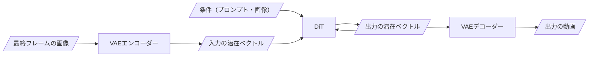

```mermaid
block-beta
    columns 72
    1Section:36 2Section:36
    1LF:4 2LF:4 3LF:4 4LF:4 5LF:4 6LF:4 7LF:4 8LF:4 9LF:4 10LF:4 11LF:4 12LF:4 13LF:4 14LF:4 15LF:4 16LF:4 17LF:4 18LF:4
    1F 2F 3F 4F 5F 6F 7F 8F 9F 10F 11F 12F 13F 14F 15F 16F 17F 18F 19F 20F 21F 22F 23F 24F 25F 26F 27F 28F 29F 30F 31F 32F 33F 34F 35F 36F 37F 38F 39F 40F 41F 42F 43F 44F 45F 46F 47F 48F 49F 50F 51F 52F 53F 54F 55F 56F 57F 58F 59F 60F 61f 62f 63f 64f 65f 66f 67f 68f 69f 70f 71f 72f
```

FramePackを追加学習すると、画像・動画の生成時にテキストのプロンプトでは難しい指示を守らせることができます。たとえば、等速で360度回転する、のような指示が可能です。


FramePackのLoRA学習にあたっては、[musubi-tuner](https://github.com/kohya-ss/musubi-tuner)を使うのが簡単です。とはいえ機械学習なので、どうしても試行錯誤があります。

しかし、学習の設定次第ではLossの遷移や途中にサンプルした画像をリアルタイムで確認するなど、とても管理がしやすくなります。基本からニッチな点まで、一通り書いたのでぜひご参照ください！


## そもそもFramePackとは？

[FramePack](https://github.com/lllyasviel/FramePack)は、Hunyuan(混元 = hùn yuán, フンユアン) Videoの動画生成モデルを用いた動画・画像生成フレームワークです。

Hunyuan VideoのDiffusion Transformer(DiT)に対して、既に生成したフレームと条件付けを入力して新しいフレームを生成する...ということを繰り返し、指定された長さの動画を生成します。



Stable Diffusionがそうであるように、Hunyuan VideoのDiTも画像・動画をピクセルでは扱わず、VAEによってエンコードされた潜在フレームとして扱います。さらにFramePackでは、いくつかの潜在フレームをまとめて「セクション」として扱っています。

例えば30fpsで1.2秒(72f)の動画を生成する場合、かつ1セクションあたり9潜在フレームを含む場合、その関係は次のようになります。（非常に見辛くてすみません...）



<!-- ComfyUIでFramePackを使って動画生成をされた方は、出力される動画のフレーム数として指定できる値が特徴的であることに気付いたと思いますが、それはこれが関係しています。 -->

FramePackによる学習・推論は、コミュニティベースで進化を重ねています。詳しくは[KohyaさんのNote記事](https://note.com/kohya_ss/n/nbd94d074ddef)をご覧ください。

## LoRAの学習

### 本当にLoRAが必要か？

FramePackは、自然言語での入力に対応していることもあり、かなり細かい指示ができます。

そのため、まずは素の状態の推論（画像・動画生成）でプロンプトを工夫し、それで難しければLoRAを試すのが良いでしょう。探索したプロンプトはLoRA学習でも使うので、いわばスタート地点をゴールに近づけた状態で学習を進めることができます。

### クオリティ・費用・期間

シンプルなプロンプトのみで指定できる動き・変化については、純粋に学習だけなら$25以内かつ1日以内で学習ができます。設定によりますが、一例としてはH100を$2.5/Hourで8時間借りて1,000steps程度学習できる感じでしょうか。

しかし、学習途中で設定の誤りやデータのバグに気づいたり、はたまた学習データを増やしたり、プロンプトを変更したりするのが普通です。個人的にはいい結果が出るまで5~20回は学習設定を変えています。（例えば[Turntable](https://turntable.sawara.dev)に用いているLoRAはバージョン18です。

最短を狙うなら、すでに上手く学習できている人から設定を分けてもらったり、レビューしてもらうのも手です。私でよければいつでも見るので、ご連絡ください！

### データセット

目的によってデータセットのサイズが異なります。例えば、カメラをズームするだけのようなシンプルな動きであれば、動画データが20本程度あれば学習できると思います。

「1文で指示できる範囲の動き」なら、少量のデータでも学習できる...気がします。

一方で、入力した動画・画像に応じて多様な動きをさせる場合、もうちょっとデータセットが必要かもしれません。例えば、「キャラクター」＋「指定した画風」のLoRAを開発する場合は、過学習を防ぐために50~100枚は必要なのではと考えています。この辺りは正直探っているところですが...。

### GPUクラウドの利用

FramePackのLoRA学習を快適に行うには、VRAMが体感で30GB以上必要です。そこでRTX6000AdaやH100を利用するため、筆者はGPUクラウドのRunPodを利用しています。GPUクラウドとしては Vast.ai と Lambda Cloudを学習に使ったことがありますが、次の点でRunPodを採用しています。

- 複数のインスタンス間でストレージを使いまわせる（RunPodとLambdaLabsで可能）
- 個人的にUIが分かりやすい

学習の進め方としては、初めにRTX6000Adaなど比較的安いインスタンスで5Stepsくらい学習を回します。それで設定が正しいことを確認できたら、H100などに切り替えて本格的に回すことが多いです。
（もっとも、そこまでGPUインスタンスが余ってないことも多いので、初めに確保したインスタンスをそのまま使うこともあります）

ストレージは最低200GB程度必要です。これも設定で大きく異なりますが、FramePackのベースモデル（エンコーダなども含む）で100GB、学習データで20GB、学習したモデルで40GBという感じでしょうか。

### 設定

私([@xhiorga](https://x.com/xhiroga))は、FramePackのLoRA学習では [musubi-tuner](https://github.com/kohya-ss/musubi-tuner) を使っています。

2025-07時点では、次のような設定で1フレーム学習を行なっています。

#### リポジトリ概要

次のような構成です。
```
- .git
- configs
  - v1
    - config.toml
    - dataset.toml
    - prompts.txt
  - v2
  - ...
- .gitignore
- .python-version
- pyproject.toml  # uvでプロジェクト管理。`uv add musubi-tuner`で学習スクリプト追加
- Makefile
- README.md
- uv.lock
```

[musubi-tuner](https://github.com/kohya-ss/musubi-tuner)のインストールですが、現在は`uv`や`pip`でインストールすることができます。特に`uv`で管理するのを強くお勧めします。

`uv`で管理した場合、仮想環境の管理も`uv`が賄ってくれます。RunPodなどのGPUクラウドを用いている場合は仮想環境の構築そのものは不要ですが、`uv`をタスクランナーとして用いることで、学習実行時に環境構築がされていなければ、`musubi-tuner`を含むパッケージが自動でインストールされ、非常に便利です。

環境構築の方法も非常に簡単で、`uv init --python 3.10`の後に`uv add "https://github.com/xhiroga/musubi-tuner.git[cu128]"`で良いはずです（動かなかったら教えてください）

#### config.toml

次のような構成です。なお、バージョンごとの差分を比較しやすいよう、オプションではなく`toml`で管理することをお勧めします。

```configs/v1/config.toml
dit = "/workspace/models/diffusion_models/FramePackI2V_HY/diffusion_pytorch_model-00001-of-00003.safetensors"
vae = "/workspace/models/vae/diffusion_pytorch_model.safetensors"
text_encoder1 = "/workspace/models/text_encoder/model-00001-of-00004.safetensors"
text_encoder2 = "/workspace/models/text_encoder_2/model.safetensors"
image_encoder = "/workspace/models/image_encoder/model.safetensors"
dataset_config = "/workspace/my-framepack-project/configs/v8/dataset.toml"

blocks_to_swap = 20
split_attn = true
img_in_txt_in_offloading = true

seed = 42
mixed_precision = "bf16"

sdpa = true
network_module = "networks.lora_framepack"

# シンプルなLoRAなら4/4程度でOK。
network_dim = 32
network_alpha = 16

optimizer_type = "adamw8bit"

# データセットの batch_size 次第。
# batch_size = 4 くらいまでは`1e-3`で安定
# それ以降、batch_size に合わせて`new LR = old * √(sqrt)(new batch size / old batch size)`で増やす。
learning_rate = 1e-3

gradient_checkpointing = true

max_data_loader_n_workers = 1
persistent_data_loader_workers = true

# だいたい途中で止めるので非常に多く設定しておく
max_train_steps = 5000

timestep_sampling = "shift"
discrete_flow_shift = 6.0

fp8_llm = true
vae_chunk_size = 32
vae_spatial_tile_sample_min_size = 128
one_frame = true

# データセットの枚数や`num_repeat`を変更すると、1epochごとのステップ数も変わる
# それでは変更前後のモデルを、同じくらいの学習の進み具合で比較できない
# またwandbに主に記録されるのもステップ数なので、ステップでの保存を推奨
# ただしマシンをn台使うとエポックあたりのステップ数はn分の1になるが...
save_every_n_steps = 100

# 指定したステップごとに、学習途中のLoRAを使って画像/動画を生成する
sample_at_first = true
sample_every_n_steps = 100
sample_prompts = "/workspace/my-framepack-project/configs/v1/prompts.txt"

# save_state を有効にすると `resume` で途中から学習再開できる
save_state = true
save_state_on_train_end = true

# 途中から学習再開する場合のオプション
# resume = "/workspace/my-framepack-models/my-framepack-project-v1-step00001000-state"

# モデルはHuggingFaceに直接保存するが、その場合も output_dir の設定は必要
output_dir = "/workspace/my-framepack-models"
output_name = "my-framepack-project-v8"

huggingface_repo_id = "my-id/my-framepack-models"
huggingface_repo_type = "model"
huggingface_path_in_repo = "/"
save_state_to_huggingface = true

# wandbは無料で使えるので有効化すべき
# 特に log_config を有効にしておくと、どのLoss遷移がどの設定だったか確認できて助かる
# サンプルした画像・動画もwandbに保存できる
log_with = "wandb"
log_tracker_name = "my-framepack-project"
log_config = true
```

#### dataset.toml

次のような設定です。

```dataset.toml
[general]
resolution = [512, 768]
caption_extension = ".txt"
# batch_size = 2 # RTX4090 @ 24GB
# batch_size = 8 # RTX6000Ada @ 48GB
batch_size = 16 # H100 @ 80~96GB
enable_bucket = true
bucket_no_upscale = false

[[datasets]]
# datasetを途中から追加したり、メタデータ（プロンプト等）を途中から追加することは非常によくある
# なのでどちらもバージョンをつけておいた方が良い。
image_jsonl_file = "/workspace/my-framepack-project-dataset/dataset-v1/metadata-v1.jsonl"
cache_directory = "/workspace/framepack-lora/configs/v1/cache/dataset-v1/v1"
num_repeats = 10
fp_1f_clean_indices = [0, 10]
fp_1f_target_index = 5
fp_1f_no_post = true
```

#### metadata.jsonl

次のような設定です。プロンプトは[とりにくさんのNote](https://note.com/tori29umai/n/n0704b7a05ecf)が元ネタです。

```/workspace/my-framepack-project-dataset/dataset-v1/metadata-v1.jsonl
{"image_path": "/workspace/my-framepack-project-dataset/dataset-v1/girl-pose.png", "control_path_0": "/workspace/my-framepack-project-dataset/dataset-v1/girl-pose.png", "control_path_1": "/workspace/my-framepack-project-dataset/dataset-v1/girl.png", "caption": "Convert reference images of poses and expressions into character design images."}
...
```

#### 学習用コマンド

私は`Makefile`にまとめることが多いです。

```Makefile
train:
	IMAGE_ENCODER=$$(uv run python -c 'import toml; d=toml.load(open("$(CONFIG_FILE)", "r")); print(d["image_encoder"])')

	uv run wandb login $(WANDB_API_KEY)
	uv  run \
		accelerate launch \
			--num_processes 1 \
			--dynamo_backend=no \
			--mixed_precision bf16 \
			-m musubi_tuner.fpack_train_network \
				--image_encoder $$IMAGE_ENCODER \
				--config_file $(CONFIG_FILE) \
				--huggingface_token $(HUGGINGFACE_TOKEN)
	sleep 10m ; runpodctl stop pod $(RUNPOD_POD_ID) &

cache:
	DATASET_CONFIG=$$(uv run python -c 'import toml; d=toml.load(open("$(CONFIG_FILE)", "r")); print(d["dataset_config"])')
	VAE=$$(uv run python -c 'import toml; d=toml.load(open("$(CONFIG_FILE)", "r")); print(d["vae"])')
	IMAGE_ENCODER=$$(uv run python -c 'import toml; d=toml.load(open("$(CONFIG_FILE)", "r")); print(d["image_encoder"])')
	TEXT_ENCODER1=$$(uv run python -c 'import toml; d=toml.load(open("$(CONFIG_FILE)", "r")); print(d["text_encoder1"])')
	TEXT_ENCODER2=$$(uv run python -c 'import toml; d=toml.load(open("$(CONFIG_FILE)", "r")); print(d["text_encoder2"])')

	uv run -m musubi_tuner.fpack_cache_latents \
		--dataset_config $$DATASET_CONFIG \
		--vae $$VAE \
		--image_encoder $$IMAGE_ENCODER \
		--one_frame

	uv run -m musubi_tuner.fpack_cache_text_encoder_outputs \
		--dataset_config $$DATASET_CONFIG \
		--text_encoder1 $$TEXT_ENCODER1 \
		--text_encoder2 $$TEXT_ENCODER2 \
		--batch_size 16
```

ポイントは次のとおりです。

- バージョンを重ねた時に設定の変更漏れがないよう、`config.toml`を信頼できる唯一の情報源として、それ以外の値は`config.toml`を動的にパースして取得しています。
- RunPodでの実行を想定しています。学習後に`sleep 10m ; runpodctl stop pod $(RUNPOD_POD_ID) &`と実行することで、自動でインスタンスを落とせます。

### 実行

`tmux`などで仮想ターミナルを作成して、その中で学習を走らせます。同時に、別のターミナルで`uvx nvitop`を実行してGPUの利用状況を確認することが多いです。特に、学習の初期ではバッチサイズを調整するため、GPUがどの程度使われているかは細かく確認したいと思います。


状況によって全く異なると思いますが、一例として学習時のwandbのLossは次のようになります。成功している時のLossは0.01付近か以内であることが多いでしょうか。


Lossの遷移が普段と違うな？と思ったら、設定を見直してもいいかもしれません。例えば私の場合、`resume`なしで学習していきなりLossが`0.01`付近だったら、入力画像と教師画像が同じ画像になっちゃってた、ということがありました。

## LoRAによる推論

注意点は次のとおり

- プロンプトは学習時と全く同じものを使う。(Llamaのベクトルを経由しているにも拘らず)文章が少し違うだけで結果が反映されないことがあるらしい？


ComfyUIを用いて推論することもできます。一方musubi-tunerでも、バッチ推論を行うことができます。

ComfyUIの環境構築は大変ですし、musubi-tunerでの推論がお勧めです。次のように指定できます。

```bash
uv run -m musubi_tuner.fpack_generate_video \
--fp8_scaled \
--fp8_llm \
--from_file /workspace/my-framepack-project/configs/v8/prompts.txt \
--output_type latent_images \
--dit /workspace/models/diffusion_models/FramePackI2V_HY/diffusion_pytorch_model-00001-of-00003.safetensors \
--vae /workspace/models/vae/diffusion_pytorch_model.safetensors \
--text_encoder1 /workspace/models/text_encoder/model-00001-of-00004.safetensors \
--text_encoder2 /workspace/models/text_encoder_2/model.safetensors \
--image_encoder /workspace/models/image_encoder/model.safetensors \
--vae_spatial_tile_sample_min_size 128 --vae_chunk_size 32 --blocks_to_swap 20 \
--attn_mode sdpa \
--lora_weight /workspace/my-framepack-models/my-framepack-project-v8-step00005000.safetensors \
--lora_multiplier 1.2 \
--save_path /workspace/my-framepack-models/sample/v8-step00005000-lm1.2
```

## まとめ

TODO

TODO: ここに宣伝
