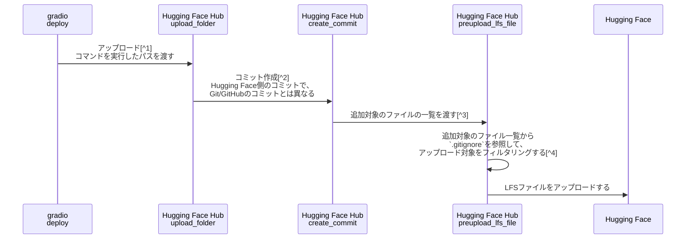

## TL;DR

- Hugging Face Hubは、`.gitignore` に当てはまるファイルをアップロードしません。
- 2024年2月1日時点では、Hugging Face Hubが参照する`.gitignore`は、アップロードを行うフォルダ内にあるものだけです。
- フォルダがGitリポジトリのルートではない場合、親フォルダの`.gitignore`でモデルを除外することで、Gitの管理対象外にしつつ、Hugging Face Hubにアップロードすることができます。

## 動機

私は技術の素振りや勉強した内容を、til(Today I Learned)リポジトリでまとめています。
機械学習のモデルのデモをHugging Faceを通じて公開したいと考え、Git LFSでコミットをしていました。しかし、Git LFSは無料プランでの使用制限があり、また、リポジトリのサイズが大きくなるため、他のコードと一緒に管理するのが難しいと感じました。

`gradio`と`huggigface_hub`の挙動を追いかける中で、親フォルダの`.gitignore`を参照することで、Gitの管理対象外にしつつ、Hugging Face Hubにアップロードできることに気づきました。

## 手順

親フォルダの`.gitignore`で再帰的に`models`フォルダを除外し、アップロード対象の子フォルダ(`gradio deploy`をするフォルダ)では`.gitignore`を設定しません。
ただし、モデルのスナップショットなどを部分的に除外したい場合は、子フォルダに`.gitignore`を設定する必要があります。

フォルダ構造は次のとおりです。

```tree
root/
│
├── .gitignore
│
├── my_project/
│   ├── .gitignore  # 必要な場合のみ
│   │
│   ├── model/
│   │   ├── model_file_1
│   │   └── model_file_2
│   │
│   ├── data/
│   │   ├── data_file_1
│   │   └── data_file_2
│   │
│   └── code/
│       ├── script_1.py
│       └── script_2.py
│
└── other-files/
    ├── document_1.md
    └── image_1.png
```

ファイルの内容は次のとおりです。

```.gitignore
# root/.gitignore

**/models/
```

```.gitignore
# root/my_project/.gitignore

models/snapshot/ # 無くてもよいが、私は学習ごとにスナップショットを保存しているので設定した。
```

スクリーンショットは次のとおりです。


私のtilリポジトリの実例は、[こちら](https://github.com/xhiroga/til/tree/main/computer-science/machine-learning)。

### 注意事項

スナップショットなどを子リポジトリ側で除外するのを忘れがちです。普段は`.gitignore`されているファイルはアップロードされない前提で考えているので、Gitでトラックされていないと安心してしまうんですよね。


## どうしてこれで動くのか？

Hugging Face Hubは、`.gitignore` に当てはまるファイルをアップロードしません。元々は異なる挙動だったようですが、こちらが望ましい挙動として2023年11月に変更されたようです。

https://github.com/huggingface/huggingface_hub/issues/1826

次のシーケンス図は、私自身の納得のために調べたもので、正確さは保証できません。ご了承ください。



[^1]: https://github.com/gradio-app/gradio/blob/68a54a7a310d8d7072fdae930bf1cfdf12c45a7f/gradio/cli/commands/deploy_space.py#L14
[^2]: https://github.com/huggingface/huggingface_hub/blob/3788f537b10c7d02149d6bf017d2ce19885f90a2/src/huggingface_hub/hf_api.py#L4294
[^3]: https://github.com/huggingface/huggingface_hub/blob/3788f537b10c7d02149d6bf017d2ce19885f90a2/src/huggingface_hub/hf_api.py#L3604
[^4]: https://github.com/huggingface/huggingface_hub/blob/3788f537b10c7d02149d6bf017d2ce19885f90a2/src/huggingface_hub/hf_api.py#L4090

## まとめ

この方法を利用すれば、Hugging Faceでモデルを共有しながら、Gitリポジトリをすっきりと保つことができます。特に大きなモデルファイルを扱う場合、Gitリポジトリのサイズを抑えることができるのは大きな利点です。Hugging FaceとGitを組み合わせたい方の参考になれば幸いです。
