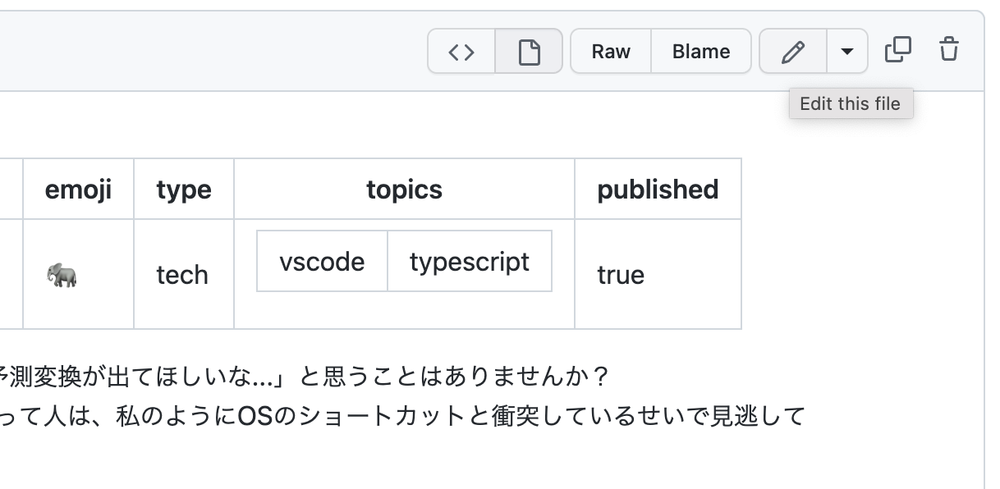
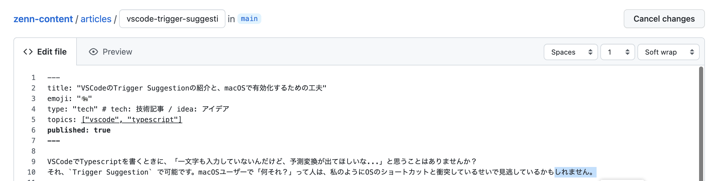
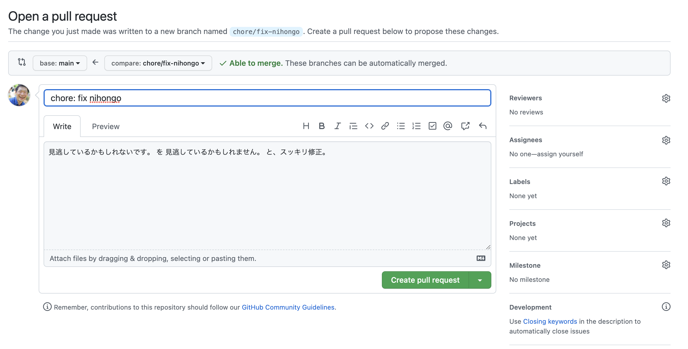
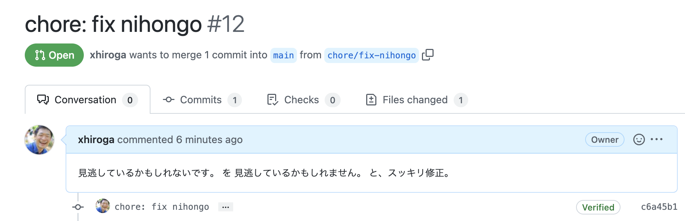
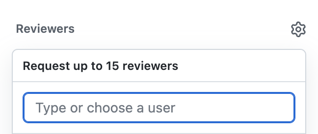

エンジニアの人に頼まずに文言修正をしたいこと、ありませんか？  
でも、そのためにローカルにGitやVSCodeのインストールをして、Pull Requestの出し方を勉強して...は大変ですよね。  
実はGitHubのの画面だけで、修正からPullRequestまでが完結します！（ただし修正箇所が1ファイルのみの場合）

## 手順

1. 編集したいファイルを開き、`Edit this file` から編集モードに切り替え
2. ファイルを編集
3. 修正を保存（新しいブランチの作成を選択）
4. 作成したブランチで、そのままPull Requestを作成
5. 作成したPullRequestのレビューをチームメンバーに依頼

## 1. 編集したいファイルを開き、`Edit this file` から編集モードに切り替え

ファイル右上のメニューから✏️アイコンをクリックし、編集モードに入ります。

## 2. ファイルを編集

普通にファイルを編集します。

## 3. 修正を保存（新しいブランチの作成を選択）

修正のタイトル、修正内容を入力し、修正を保存します。  
保存する前に、ラジオボタンから`Create a new branch for this commit and start a pull request. Learn more about pull requests.`を選択します。また、ブランチ名を決めてください。  
この例では `chore/fix-nihongo` としていますが、デフォルトで候補が入力されているはずなので、それで構わないと思います（開発チームによります）

## 4. 作成したブランチで、そのままPull Requestを作成

前の画面で修正を保存すると、そのままPull Requestの作成画面に移ります。  
前の画面の修正のタイトル、修正内容が使われているはずなので、そのまま `Create pull request` で作成します。

## 5. 作成したPullRequestのレビューをチームメンバーに依頼

作成したPull RequestのURLをチームメンバーに伝え、レビューを依頼します。  

このとき、右側のレビュワーを指定してあげるとより親切ですよ！

## まとめ

PCにGitやVSCodeをインストールしなくても、ブラウザとGitHubのアカウントがあれば簡単なPRは作れます。お役に立てば幸いです。
