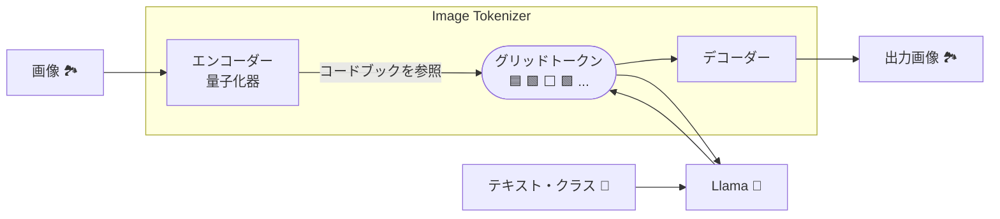

## Autoregressive Model Beats Diffusion: Llama for Scalable Image Generation[^Sun_et_al_2024]

[^Sun_et_al_2024]: P. Sun et al., “Autoregressive Model Beats Diffusion: Llama for Scalable Image Generation,” Jun. 10, 2024, arXiv: arXiv:2406.06525. doi: 10.48550/arXiv.2406.06525.

https://arxiv.org/abs/2406.06525

なお、fmuuly氏による「[Llamaで画像生成：LlamaGen【論文】](https://zenn.dev/fmuuly/articles/40f4863385b7d8)」も分かりやすくてオススメです。

## Note

この記事の内容を、2024-12-03に行われる [松尾研LLMコミュニティ【Paper & Hacks】#28](https://matsuolab-community.connpass.com/event/338122/) にて発表します。

## はじめに

近年の画像生成AIの発展は目覚ましく、その中でも**拡散モデル**は高品質な画像生成を可能にする手法として注目を集めています。拡散モデルは、画像にノイズを徐々に加えていき、最終的に完全なノイズになった状態から、逆向きにノイズを除去していくことで画像を生成します。この手法は、複雑な画像分布を学習するのに優れていますが、生成過程が逐次的であるため、計算コストが高いという課題があります。

一方、自然言語処理で成功を収めている**自己回帰モデル**は、系列データを前の時刻のデータから予測するモデルです。文章生成で言えば、前の単語から次の単語を予測していくことで文章を生成します。この考え方を画像生成にも適用したのが、**自己回帰型画像生成モデル**です。自己回帰モデルは並列処理が可能であるため、拡散モデルに比べて高速な画像生成が期待できます。しかし、高解像度の画像をそのままピクセル単位で自己回帰モデルに適用すると、計算量が爆発的に増加してしまうという問題がありました。

本稿で紹介する **LlamaGen** は、LLMであるLlamaを自己回帰型画像生成モデルに応用した研究です。LlamaGenは、画像をトークン化し、そのトークン列をLlamaを用いて自己回帰的に生成することで、高品質な画像生成を実現します。

## 関連研究

* **PixelCNN:** 自己回帰モデルによる画像生成の先駆け的な研究。
* **ImageGPT:** Transformerを用いた自己回帰型画像生成モデル。
* **VQGAN:** ベクトル量子化を用いたImage TokenizerとCNNを用いた自己回帰型画像生成モデル。
* **DiT:**  ノイズの除去にTransformerを用いた拡散モデル。
* **PixArt-α:** Stable Diffusionよりも少ない計算量で高品質な画像を生成する拡散モデル。

## LlamaGenのアーキテクチャ

LlamaGenは、主に2つのモジュールから構成されています。

1. **Image Tokenizer:** 画像を離散的なトークン列に変換するモジュール。VQGAN で提案されたアーキテクチャをベースにしています。
2. **Autoregressive Transformer (Llama):** トークン列を入力として受け取り、自己回帰的に次のトークンを予測することで画像を生成するモジュール。LLMであるLlamaをベースにしています。

## 自己回帰モデルと拡散モデルの比較

## LlamaGenとViTの比較

Transformerを画像言語モデルで用いた例としては、ViT[^Dosovitskiy_et_al]が有名です。
[^Dosovitskiy_et_al]: A. Dosovitskiy et al., “An Image is Worth 16x16 Words: Transformers for Image Recognition at Scale,” Oct. 22, 2020, arXiv: arXiv:2010.11929. doi: 10.48550/arXiv.2010.11929.

LlamaGenとViTの違いをまとめました。

| 特徴             | LlamaGen                             | ViT                                          |
| ---------------- | ------------------------------------ | -------------------------------------------- |
| アーキテクチャ   | GPT (=Transformer Decoder)           | Transformer Encoder                          |
| 主なタスク       | 画像生成                             | 画像のクラス分類                             |
| トークン化の対象 | 画像のパッチ                         | 画像のパッチ                                 |
| トークン化の方法 | ベクトルを量子化しコードブックに対応 | ベクトルを全結合層で変換しパッチ埋込みを得る |

Transformerを用いる点とトークン化の対象は同じですが、利用する型（エンコーダ・デコーダ）やタスク、トークン化の方法が異なります。

## Image Tokenizer

Image Tokenizerは、高解像度画像を効率的に処理するために、画像をトークンの系列に変換する重要なモジュールです。Transformer ベースのモデルは系列長に対して計算コストが二次関数的に増加するため、高解像度画像をピクセルごとにトークン化すると、計算量が爆発的に増加してしまいます。Image Tokenizer は、画像をより短いトークン列に変換することで、この問題を解決します。

### Image Tokenizerの関連研究

LlamaGen で用いられた Image Tokenizer は、VQGAN[^Esser_et_al_2021] で提案されたものとほぼ同じアーキテクチャです。VQGAN は、Image Tokenizer と自己回帰モデルを組み合わせることで、高解像度画像の生成を可能にしました。

[^Esser_et_al_2021]: P. Esser, R. Rombach, and B. Ommer, “Taming Transformers for High-Resolution Image Synthesis,” Jun. 23, 2021, arXiv: arXiv:2012.09841. doi: 10.48550/arXiv.2012.09841.

:::details VQGANとLlamaGenの違い
VQGANのアーキテクチャを次の通り示します。LlamaGenのアーキテクチャと比較すると、自己回帰モデルが異なる（Transformer or Llama）ことが分かります。

:::

### Image Tokenizerの仕組み

VQGAN（および LlamaGen）の Image Tokenizer は、エンコーダー、量子化器、デコーダーの3つの部分から構成されています。

1. **エンコーダー:** 入力画像を低次元の特徴マップに変換します。
2. **量子化器:** 特徴マップの各ベクトルを、学習済みコードブック中の最も近いコードベクトルに置き換えます。このコードベクトルがトークンとなります。
3. **デコーダー:** トークン列から画像を再構成します。

このプロセスにより、画像は少数のトークンで表現され、Transformer で効率的に処理できるようになります。

### ベクトル量子化

ベクトル量子化は、連続的なベクトル空間を離散的なコードブックで表現する手法です。VQ-VAE (Vector Quantized Variational AutoEncoder) などで利用されており、画像や音声などの高次元データを効率的に圧縮・表現することができます。

TODO: ベクトル量子化についてもう少し詳しく説明

なお、ベクトル量子化については「ソフテックだより」の記事[^Softech_2012]が分かりやすかったです。
[^Softech_2012]: https://www.softech.co.jp/mm_120704_pc.htm

### Image Tokenizerの評価

画像の情報の圧縮率を測るための値として、「ダウンサンプル比」と「コードブックの語彙数」があります。カメラで例えれば、「解像度」と「色の階調」ということになるでしょうか。エンコーダーが画像を畳み込む前後の比率がダウンサンプル比であり、量子化器がマッピングする先のベクトルの種類がコードブックの語彙数です。

したがって、例えば256x256の画像をダウンサンプル比8のImage Tokenizerでトークン化すると、必要なトークン数は1024となります（256/8 * 256/8 = 1024）。

LlamaGenのImage Tokenizerは、ダウンサンプル比が8と16の場合で、コードブックの語彙数が4096から32768の場合でそれぞれ学習されています。ちなみに、Llama3のボキャブラリーの数は128Kトークン[^Llama3]です。
[^Llama3]: https://ai.meta.com/blog/meta-llama-3/

## Next-Token予測による画像生成

LlamaGen は、Image Tokenizer によって生成されたトークン列を LLM (Llama) に入力し、自己回帰的に次のトークンを予測することで画像を生成します。これは、自然言語処理における文章生成と同様のアプローチです。

### Next-Token予測による画像生成の関連研究

自己回帰モデルによる画像生成は、PixelCNN や ImageGPT など、以前から研究されてきました.  LlamaGen は、これらの先行研究と同様に、自己回帰モデルを利用していますが、LLM である Llama を採用することで、スケーラビリティと生成品質の向上を実現しています。

### 画像生成の損失関数

LlamaGen の訓練では、生成された画像が入力画像に近づくように、以下の損失関数を最小化します。

$$
\begin{align}
L_{AE} = I_2 (x, \widehat{x}) + L_P (x, \widehat{x}) + \lambda_G L_G (\widehat{x})
\end{align}
$$

ここで、

* $L_2(x, \hat{x})$ は、入力画像 $x$ と生成画像 $\hat{x}$ の間のピクセル単位の平均二乗誤差です。
* $L_P(x, \hat{x})$ は、入力画像 $x$ と生成画像 $\hat{x}$ の間の知覚的損失です。LPIPS[^Zhang_et_al_2018] を使用します。
* $L_G(\hat{x})$ は、生成画像 $\hat{x}$ に対する敵対的損失です。PatchGAN 識別器を用います。

[^Zhang_et_al_2018]: R. Zhang, P. Isola, A. A. Efros, E. Shechtman, and O. Wang, “The Unreasonable Effectiveness of Deep Features as a Perceptual Metric,” Apr. 10, 2018, arXiv: arXiv:1801.03924. doi: 10.48550/arXiv.1801.03924.

### CFG (Classifier-Free Guidance)

LlamaGen は、Stable Diffusion と同様に、Classifier-Free Guidance (CFG) を用いて条件付き画像生成を行います。CFG は、分類器を用いることなく、テキストなどの条件情報を画像生成プロセスに組み込むことができる手法です。

TODO: CFG について詳しく説明。条件付きと条件なしのモデルの学習、推論時の動作など。

なお、CFGを理解するにあたってかくびー氏のブログ[^cakkby6_2023]が分かりやすかったです。
[^cakkby6_2023]: <https://cake-by-the-river.hatenablog.jp/entry/stable_diffusion_8>

## 評価

LlamaGen の性能は、FID (Fréchet Inception Distance)、IS (Inception Score)、rFID (Reconstruction FID)、sFID (sliced FID)、Precision/Recall、PSNR、SSIM などの指標を用いて評価されます。

### 評価指標の説明

* **IS (Inception Score):** 生成画像の品質と多様性を測定する指標。高いほど良い。
* **FID (Fréchet Inception Distance):** 生成画像と実画像の分布間の距離を測定する指標。小さいほど良い。
* **rFID (Reconstruction FID):** 入力画像と再構成画像の FID。小さいほど良い。
* **sFID:** FID の改良版。
* **Precision/Recall:** 生成画像の精度と再現率。
* **PSNR (Peak Signal-to-Noise Ratio):**  画質の客観的評価指標。高いほど良い。
* **SSIM (Structural Similarity Index):** 画質の客観的評価指標。1に近いほど良い。

### IS (Inception Score)[^Salimans_et_al_2016]

[^Salimans_et_al_2016]: T. Salimans, I. Goodfellow, W. Zaremba, V. Cheung, A. Radford, and X. Chen, “Improved Techniques for Training GANs,” Jun. 10, 2016, arXiv: arXiv:1606.03498. doi: 10.48550/arXiv.1606.03498.

**TODO**

なお、mm_0824氏のブログ[^mm_0824_2021]が分かりやすかったです。
[^mm_0824_2021]: <https://data-analytics.fun/2021/12/12/understanding-inception-score/>

### FID (Fréchet inception distance)[^Heusel_et_al_2017]

[^Heusel_et_al_2017]: M. Heusel, H. Ramsauer, T. Unterthiner, B. Nessler, and S. Hochreiter, “GANs Trained by a Two Time-Scale Update Rule Converge to a Local Nash Equilibrium,” Jan. 12, 2018, arXiv: arXiv:1706.08500. doi: 10.48550/arXiv.1706.08500.

フレチェインセプション距離

**TODO**

- いかに多様な画像を生成できるか？
  - 本物の画像と、埋め込み表現を計算してその距離を測る
  - 具体的にはImageNetやCOCOを用いることが多い。今回はImageNet256x256らしい、それって何枚？
- Inception-V3で埋め込みを計算する（あれ、Inception-V3ってクラス分類のモデルでは？）
- 小さいほど良い。BigGANで約7, 最新の評価にはDiffusionで2くらい **TODO: 単位は?**

### Precision/Recall

## LLMエコシステム

### スケールアップ

LlamaGenのアーキテクチャはLlamaとほぼ同じであるため、LLMコミュニティの最適化技術がそのまま利用できる。

LlamaGenではDDPとFSDPを採用している。どちらも共にGPUメモリ最適化の手法である。LlamaGenでは、パラメータ数1.4B以下のモデルではDDPを利用している。

### vLLM

LlamaGen は、vLLM を用いることで推論を高速化しています。vLLM は、大規模言語モデルの推論に特化したライブラリで、効率的なメモリ管理や並列処理など、様々な最適化技術を提供しています。

TODO: vLLM による高速化のメカニズムと効果

## まとめ

LlamaGen は、LLM である Llama を自己回帰型画像生成に応用した、新しい画像生成モデルです。高品質な Image Tokenizer と効率的な訓練手法により、拡散モデルに匹敵する生成品質を達成しながら、高速な画像生成を可能にしています。

TODO: LlamaGen の主要な貢献をまとめる。

## 感想と将来展望

LlamaGen は、LLM を画像生成に応用するという点で非常に興味深い研究です。しかし、まだ発展途上の技術であり、いくつかの課題も残されています。例えば、トークン数の制御やマルチモーダルへの拡張などが挙げられます.

TODO: LlamaGen の改善点、発展方向性、他のモダリティへの応用可能性、将来展望について記述。
