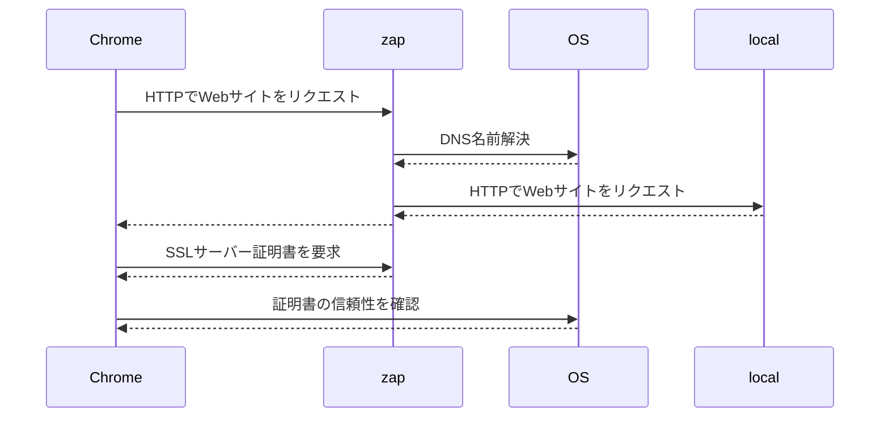

## TL;DR

次の3ステップの設定が必要です。

1. Chromeのプロキシ設定
2. localhostのサブドメインを解決する設定
3. OWASP ZAPのサーバー証明書を解決する設定

なお、Firefoxを用いる方法は、外部サービスとの通信で躓いてしまったので記事にしていません。

### シーケンス解説
<!-- 
    participant OS
    participant Chrome
    participant zap as OWASP ZAP
    participant local as Local Server
    participant 3rd as 外部サービス

    Chrome->>zap: HTTPでWebサイトをリクエスト
    zap->>OS: DNS名前解決
    OS-->>zap: 
    zap->>local: HTTPでWebサイトをリクエスト
    local-->>zap: 
    zap-->>Chrome: Webサイトを返却
    Chrome->>Chrome: JavaScriptが外部サーバーへのHTTPS通信を要求
    Chrome->>zap: SSLサーバー証明書を要求
    zap-->>Chrome: 
    Chrome->>OS: 証明書の信頼性を確認
    OS-->>Chrome: 
    Chrome->>zap: HTTPSでAPIにリクエスト
    zap->>3rd: HTTPSでAPIにリクエスト
    3rd-->>zap: 
    zap-->>Chrome: 
 -->

## 設定手順

### Chromeのプロキシ設定

検索した限り、3通りのメジャーな方法があります。

1. Chromeの設定でプロキシサーバーを設定し、同時にChrome起動時変数でLocalhostへの通信をバイパスしないように設定
2. [Proxy SwitchyOmega](https://chrome.google.com/webstore/detail/proxy-switchyomega/padekgcemlokbadohgkifijomclgjgif)で設定
3. [Proxy SwitchySharp](https://chrome.google.com/webstore/detail/proxy-switchysharp/dpplabbmogkhghncfbfdeeokoefdjegm)で設定

[Proxy SwitchySharp](https://chrome.google.com/webstore/detail/proxy-switchysharp/dpplabbmogkhghncfbfdeeokoefdjegm)を用いると、Chromeの起動時変数を触らずにアドオン設定画面から`<-loopback>`（バイパス対象からループバック通信を除外する）設定が可能です。  
詳細は画像をご覧ください。

### localhostのサブドメインを解決する設定

次の2通りの方法があります。
- `/etc/hosts` を編集する
- `Dnsmasq` のようなDNSサーバーをローカルに立てる

もしかしたら、「localhostのサブドメインって、なにも設定しないでも通信できているよ？」と思うかもしれません。Chromeの場合は自動で解決してくれるようなのですが、FirefoxやOWASP ZAPはOSのデフォルト設定を用いているようで、かつOSのデフォルト設定では解決してくれません。それで、追加設定が必要なんですね。

具体的な設定方法は割愛します。

### OWASP ZAPのサーバー証明書を解決する設定

OWASP ZAPの設定から、証明書を適当なフォルダに保存します。

次いで、Keychain AccessのSystemに対して証明書をドラッグアンドドロップで登録し、TrustをAlways Trustに設定します。

以上で設定は終了です。

## 参考

- [macOS × Chrome でローカルプロキシツール Burp Suite を利用する](https://zenn.dev/faycute/articles/eb490f8839acda)
