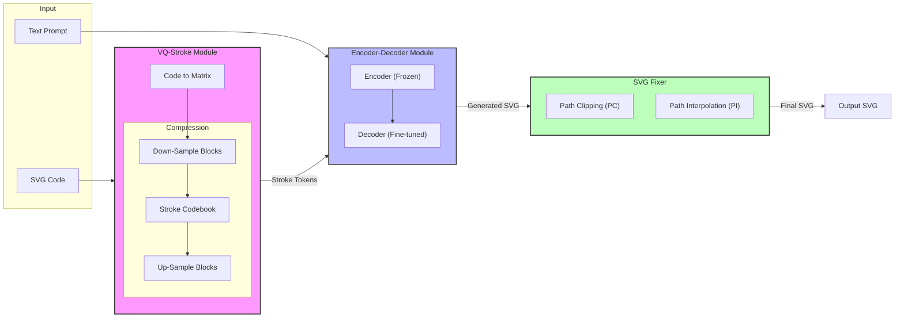

## StrokeNUWA: Tokenizing Strokes for Vector Graphic Synthesis[^Tang_et_al_2024]

http://arxiv.org/abs/2401.17093

[^Tang_et_al_2024]: Z. Tang et al., “StrokeNUWA: Tokenizing Strokes for Vector Graphic Synthesis,” Jan. 30, 2024, arXiv: arXiv:2401.17093. Accessed: Nov. 13, 2024. [Online]. Available: http://arxiv.org/abs/2401.17093

## TL;DR

- Microsoft Researchと中国の苏州大学 (Soochow University)の研究チームが、新しいSVG生成手法「StrokeNUWA」を発表
- 従来の「グリッドトークン」方式ではなく「ストロークトークン」を採用し、以下の利点を実現：
  - セマンティックな特徴の保持
  - LLMとの高い互換性
  - 高い圧縮率による生成速度の向上
- Stable Diffusionで画像を生成してからLIVE法[^Ma_et_al_2022]でSVG化するのに対して94倍高速

[^Ma_et_al_2022]: X. Ma et al., “Towards Layer-wise Image Vectorization,” arXiv.org. Accessed: Oct. 08, 2024. [Online]. Available: https://arxiv.org/abs/2206.04655v1

## どうしてこの論文を読んだの？

- AIが人間のように絵を描く方法として、自己回帰モデルによって1ストロークづつ生成する手法に注目していた
- もともとIconShop[^Wu_et_al_2023]という研究を知っていた
- StrokeNUWAはIconShopに比べてストロークをより自然な形で分解できることが気になった

[^Wu_et_al_2023]: R. Wu, W. Su, K. Ma, and J. Liao, “IconShop: Text-Guided Vector Icon Synthesis with Autoregressive Transformers,” arXiv.org. Accessed: Oct. 08, 2024. [Online]. Available: https://arxiv.org/abs/2304.14400v4

## 課題

この研究は、IconShopが行った自己回帰モデルによるSVG生成を発展させた研究です。自己回帰モデルによるSVG生成には、次のような意義があります。

1. 自己回帰**ではない**モデルによるSVG生成の限界に挑む
   1. 拡散モデルやパスを反復的に最適化する形でのSVG生成（LIVE法）は、画像として破綻している部分が生じる
   2. 具体的には身体のパーツが欠けたり、不自然に伸びたりするなど
2. 自己回帰モデルでも、画像をパッチワーク状に分割（グリッドトークン）する方式の限界に挑む
   1. 画像のセマンティックな特徴を捉えづらい
   2. 圧縮率が低い

なお、本論文の発表（2024年1月）より後にLlamaGen[^Sun_et_al_2024]が発表（2024年6月）されています。LlamaGenの論文では、自己回帰モデルによるグリッドトークンを用いた画像生成が拡散モデルに並ぶポテンシャルがあると主張しています。
[^Sun_et_al_2024]: P. Sun et al., “Autoregressive Model Beats Diffusion: Llama for Scalable Image Generation,” Jun. 10, 2024, arXiv: arXiv:2406.06525. doi: 10.48550/arXiv.2406.06525.

## アプローチ：ストロークトークン

StrokeNUWAは、これらの課題を解決するために「ストロークトークン」という新しいアプローチを採用しています。

### ストロークトークンとは

もともとIconShopでは、SVGの線や丸・長方形などのパスをそのままトークンとして扱うのではなく、ペンの移動（コマンド）に分解した上でトークンとして扱っていました。（この方式に名前はありませんが、敢えて言えば「コマンドトークン」でしょうか？）

SVGは実はできることが非常に多くて、グラデーション、ぼかし、ドロップシャドウ、アニメーションなどの機能があります。研究にあたってはそれらを除外したほうが良さそうですね。それに加えて、長方形を長方形として学ぶのではなく、4つの辺として学んだほうが、汎化能力が高そうというのは直感的に納得できます。

StorkeNUWAではIconShopから一歩進んで、よく使われる一連のペンの移動をまとめたかったのだと思います。この辺りは自然言語処理のトークナイザーに似ていますね。そのような一連の単位を論文ではストロークトークンと呼んでおり、例えばイルカの形をした図形のヒレ部分が1つのトークンになるなど、本質的にセマンティックであると主張しています。

## アーキテクチャ

StrokeNUWAは3つの主要コンポーネントで構成されています。

SVGコードをストロークトークンに変換するVQ-Stroke, テキストとストロークトークンを入力にストロークトークンを生成するFlan−T5ベースのLLM, 生成されたストロークトークンのSVGパスとしての整合性を保つSVG Fixerから成り立っています。

### VQ-Stroke

SVGパスをストロークトークンに還元するコンポーネントです。SVGパスをコマンドの羅列に分解し、パスを行、コマンドを列とした行列に変換する工程と、行列をCNNでストロークトークンに変換する工程に分かれます。

パスごとに畳み込みをすると思われ、そのため入力は行列ですが1次元畳み込みを適用しています。

## 実験

### データセット

FIGR-8-SVG[^marcdemers_2019]データセットで訓練しています。元々GANのFew-Shot性能を測るためのデータセットとしてFIGR-8[^Clouatre_and_Demers_2019]があり、そのSVG版のようです。
[^marcdemers_2019]: https://github.com/marcdemers/FIGR-8-SVG
[^Clouatre_and_Demers_2019]: L. Clouâtre and M. Demers, “FIGR: Few-shot Image Generation with Reptile,” Jan. 08, 2019, arXiv: arXiv:1901.02199. doi: 10.48550/arXiv.1901.02199.

FIGR-8-SVGには150万近いSVGアイコンがあると思われ（なおFIGR-8には1,548,944個のSVGアイコンがあります）、StrokeNUWAそのうち75万枚を訓練に用いています。

### 評価

生成速度については、SVG1枚あたり20秒程度のようです。IconShopが60秒程度であったことに比べると3倍となっています。パスを分割しただけのコマンドを扱うより、ストロークトークンを扱ったほうが、生成するトークンが少なくて済みそうなので、直感的には納得できます。

また品質については、CLIPScoreとFIDを用いて評価しています。CLIPScore[^Hassel_2022]とは、画像のキャプションの品質を測るための指標で、テキストと画像の埋め込みのコサイン類似度を用いた評価を行います。
[^Hassel_2022]: J. Hessel, A. Holtzman, M. Forbes, R. L. Bras, and Y. Choi, “CLIPScore: A Reference-free Evaluation Metric for Image Captioning,” Mar. 23, 2022, arXiv: arXiv:2104.08718. doi: 10.48550/arXiv.2104.08718.

また、FID（フレチェ開始距離）[^Heusel_et_al_2017]についてはmm_0824さんの記事[^mm_0824_2021]が詳しいです。
[^Heusel_et_al_2017]: M. Heusel, H. Ramsauer, T. Unterthiner, B. Nessler, and S. Hochreiter, “GANs Trained by a Two Time-Scale Update Rule Converge to a Local Nash Equilibrium,” Jan. 12, 2018, arXiv: arXiv:1706.08500. doi: 10.48550/arXiv.1706.08500.
[^mm_0824_2021]: https://data-analytics.fun/2021/12/31/understanding-fid/

CLIPScoreは27程度のようです。実はCLIPScoreに馴染みがなかったので[HuggingFace上のデモ](https://huggingface.co/spaces/taesiri/CLIPScore)で試してみましたが、だいたい20~30に収まっていれば正常なようですね。

## 読んで思ったこと

- ストロークトークンの考え方に納得感があり、自分でも使ってみたいと思った。
- この研究ではストロークトークンの列挙にCNNを使っているが、BPEのような手法でシンプルかつ同様の効果が得られるのかが気になった。
- この研究をベースに、SVGに限定せずラスタ画像を学ぶための取り組みが始まるのかなと思ったし、やってみたい。
  - 真っ先に思い浮かぶのは、LIVE法などで画像をベクトル化してからStrokeNUWAの入力にすること。
