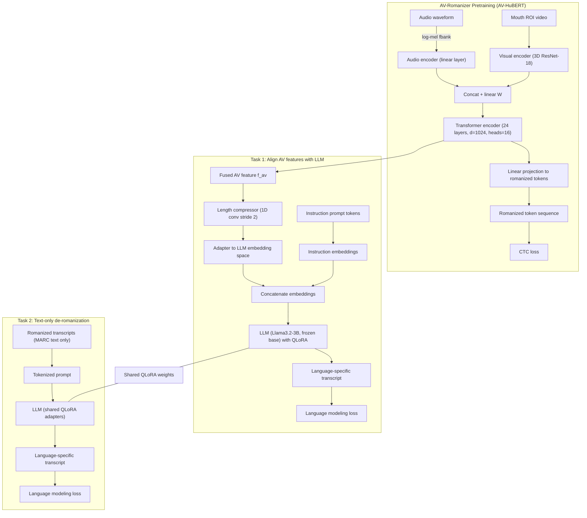

## TL;DR


## 動機


## AVSRとは？

読唇タスクに関する研究をASR, 音声と読唇の両方の情報を使って発話内容を認識する研究を AVSR (Audio-Visual Speech Recognition) といいます。


## Zero-AVSRについて

Zero-AVSRは、2025年3月にarXivにて初版が公開された、多言語対応のAVSRフレームワークです。

構成を大きく分けると、音声・読唇情報をローマ字に変換する "AV-Romanizer" と、ローマ字を文章に変換するLLMの2段から成り立っています。特に "AV-Romanizer" は、音声と読唇のデファクトの特徴抽出器の1つである "AV-HuBERT" のヘッドをローマ字分類タスク用にファインチューニングしたモデルとなっており、全体像を読み解くのが少々大変でした。詳しく解説します。

### 先行研究: HuBERT および AV-HuBERT

音声データを連続するベクトルとして表現するモデルのうち、Metaが自己教師あり学習を用いて開発したのがHuBERTです。AV-HuBERTはHuBERTを音声・視覚に拡張したモデルです。

ごく簡単に言えば、HuBERTは音声ファイルを20msごとのフレームに分割し、それぞれのフレームを256~1024次元（モデルサイズによって異なります）のベクトルに変換するモデルです。ベクトルに変換した上で、さらに下流タスクごとに異なるヘッドを装着して推論を行い、性能を測っています。

例えば、HuBERTでASRを行う場合の構成は次のとおりです。

```mermaid
```


### Cascaded Zero-AVSR


```mermaid
flowchart LR

```

### (Directly Integrated) Zero-AVSR

間にローマ字を挟む `Cascated Zero-AVSR` とは異なる、音声・読唇から抽出した特徴をそのままLLMに統合するアーキテクチャが提案されています。論文ではこちらを単に `Zero-AVSR` とよんでいます。本記事では、特に `Cascaded Zero-AVSR` と区別したい場合に `Directly Integrated Zero AVSR` と呼ぶことにします。次のようなアーキテクチャです。


```mermaid
flowchart LR

```




## Zero-AVSRを評価する

### MARC を用意する

### Cascaded Zero-AVSR を評価する

スクリプトを実行して、`Cascaded Zero-AVSR`の性能を評価します。

MARCのドイツ語コーパスを対象にAVSRタスクを実行すると、`Cascaded Zero-AVSR` 全体でそれぞれWER: 29%, CER: 17%程度の性能が得られます。また、`AV-Romanizer` が出力するローマ字＆単語区切り文字を単語列と見做した場合、WER: 42%程度の性能が得られます。

実行手順については、私がフォークした[`Zero-AVSR`](https://github.com/xhiroga/zero-avsr/)のリポジトリをご覧ください。

https://github.com/xhiroga/zero-avsr

実行の様子は次のとおりです。

```log
% bash scripts/stage1/eval.sh
[2025-10-08 14:56:01,014][__main__][INFO] - /home/hiroga/Documents/GitHub/zero-avsr/pretrained_models/av-romanizer/all/checkpoint_best.pt

.........

[2025-10-08 15:03:54,743][__main__][INFO] - ---------------------
[2025-10-08 15:03:54,744][__main__][INFO] - HYPO: gibts su
[2025-10-08 15:03:54,745][__main__][INFO] - REF: gebt es zu
[2025-10-08 15:03:54,745][__main__][INFO] - ---------------------
[2025-10-08 15:03:54,746][__main__][INFO] - HYPO: warum dat
[2025-10-08 15:03:54,746][__main__][INFO] - REF: warum das denn
[2025-10-08 15:03:54,746][__main__][INFO] - ---------------------
[2025-10-08 15:03:54,746][__main__][INFO] - Processed 735 sentences (0 tokens) in 0.0s 735000000.00 sentences per second, 1000000.00 tokens per second)
[2025-10-08 15:03:54,748][__main__][INFO] - Word error rate: 41.5876
100%|██████████████████████████████████████████████████████████████████████████████████████████████████████| 735/735 [00:00<00:00, 11753.95it/s]
Zero shot language WER, CER: 29.161822217524573, 17.073924509642328
```

スクリプトを実行すると、`zero-avsr/evaluation/clean/stage1/${lang}` 以下に推論結果が出力されます。`AV-Romanizer`の出力結果と、`Cacaded Zero-AVSR`の出力結果をそれぞれ確認することができます。

`hypo.units` はAV-Romanizerが出力した文字列です。次の推論結果はドイツ語を元にしていますが、出力がローマ字なのでウムラウト(ü など)が見当たりませんね。

```zero-avsr/evaluation/clean/stage1/deu/hypo.units
e i n e | g a n z | k l a s s i s c h e | a r t | a c h t s a m k e i t | z u | u e b e n | d a z u | m o e c h t e | i c h | s i e | g e r n e | j e t z t | e i n l a d e n | i n d e m | s i e | d i e | a u g e n | s c h l i e s s e n | s i c h | s o | b e q u e n e n | w i e | e s | g e r a d e | g e h t | h i n s a e t z e n | u n d | d i e | a u f m e r k s a m k e i t | n a c h | i n n e n | l e n k e n | z u | i h r e m | a t e m | (None-545)
d a s s | d a s | g a n z e | n a t u e r l i c h | a u c h | m a n c h m a l | i n | f e h e n s c h l a g | i s t | o d e r | a u c h | n a c h | w i e | v o r | n a c h | h i n t e n | g e h t | i s t | m i r | j e t z t | v o r | e i l e n | d i g e n | m o c h e n | g e g a n g k e n | d a | h a t t e | i f u r | m i c h | a u s g e s e h e n | e i n e n | s u p e r j o b | a n g e b o t | f u e r | e i n e r | d e r | g r o s t e n | a u t o m o b i e l h e r s t e l l e r | d i e | k o m p l e t t e | d i g i t a l i s i e r u n g | u n d | d i e | a u t o n o m e n | a u t o s | z u | l e i t e n | a l s o | w i r k l i c h | e i n | r i e s e n j o b | a b e r | i c h | h a b e | h i c r | n i c h t | b e k o m m e n | d a | w a r | n o c h | (None-292)
...
```

`avsr.json` はGPT-4oによって補正された推論結果とGround Truthのペアです。

```zero-avsr/evaluation/clean/stage1/deu/avsr.json
[
    {
        "Ground truth": "und genau diese frage mussten wir kollegen eines großen europäischen flugzeugherstellers beantworten\n",
        "prediction": "Und genau diese Frage mussten wir Kollegen eines großen europäischen Flugzeugherstellers beantworten."
    },
    {
        "Ground truth": "das ist eine stadt in nordspanien eine alte arbeiterstadt sehr dreckige bergarbeiterstadt\n",
        "prediction": "Das in Nordspanien, dass ein alter Arbeiter statt sehr, sehr dreckige Bergarbeiter statt."
    },
    ...
]
```

### (Directly Integrated) Zero-AVSR を評価する

```log
bash scripts/stage2/eval.sh

......

[2025-10-08 19:31:24,737][__main__][INFO] -
INST:Given romanized transcriptions extracted from audio-visual materials, back-transliterate them into the original script of German, Standard. Input:
REF:gebt es zu
HYP:gibt es zu

[2025-10-08 19:31:24,737][__main__][INFO] -
INST:Given romanized transcriptions extracted from audio-visual materials, back-transliterate them into the original script of German, Standard. Input:
REF:warum das denn
HYP:warum tat er das

......

[2025-10-08 19:31:24,748][__main__][INFO] -
German WER: 27.95071335927367%
German CER: 16.331652991921707%
```

## 自撮りで試してみる


